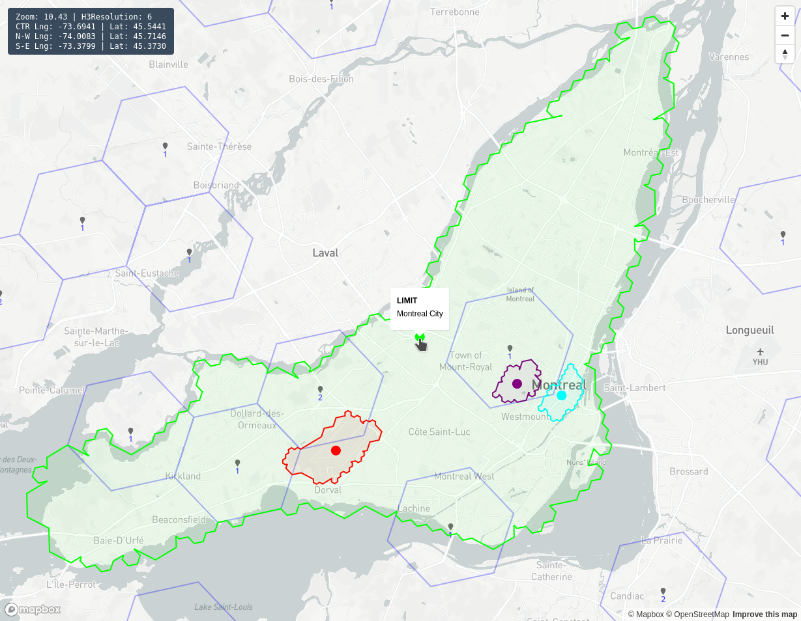
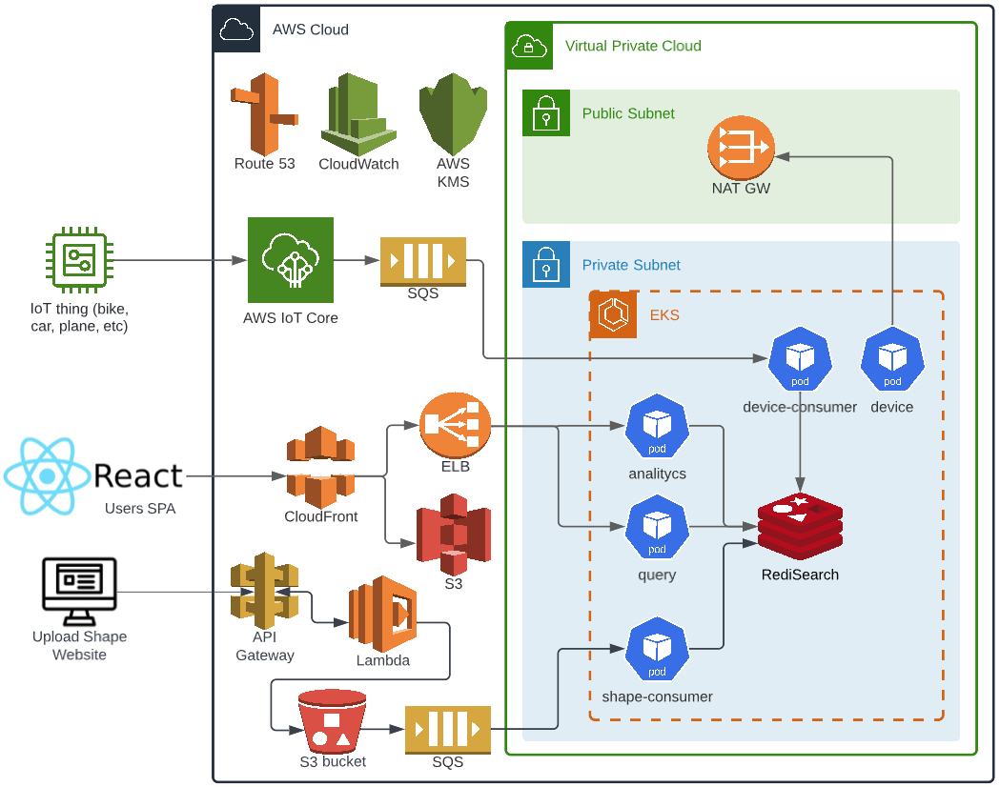
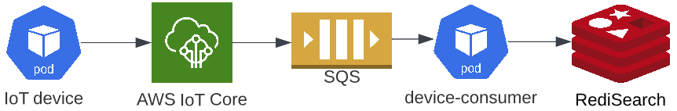
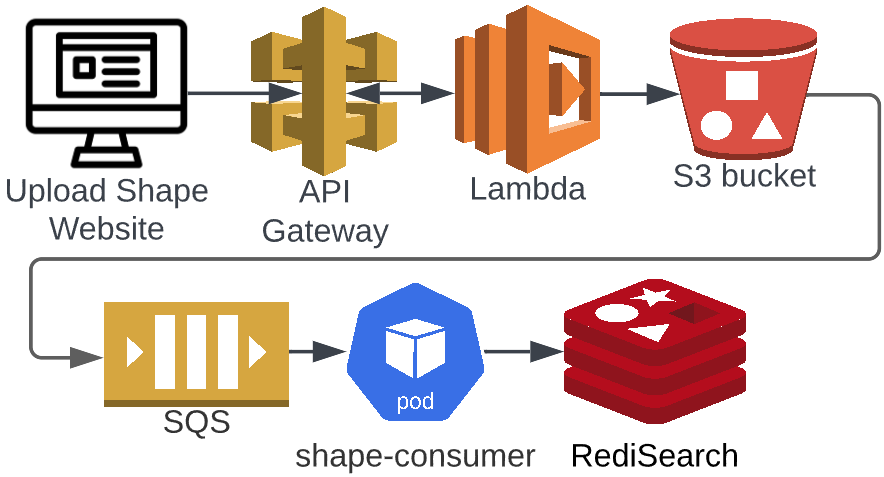
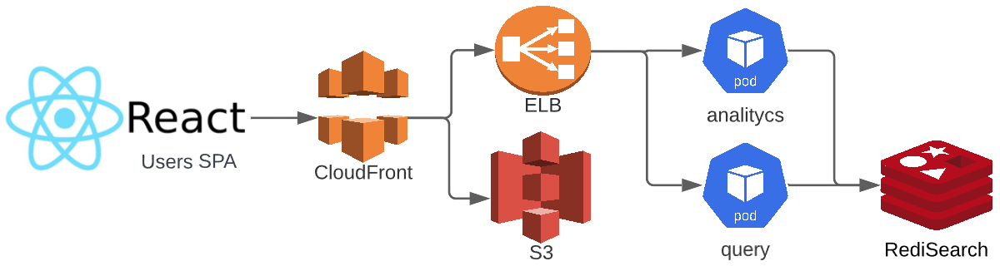

# LaFleet Project #

## Definition ##

IoT devices can be any type of device able to broadcast its coordinates (car, plane, bicycle, phone, watch, tracker, etc). Generic term “device” will be used instead of a specific type in the rest of the documentation.

## Capabilities ##

IoT devices are tracked in real-time all over the world in a single map. There are four types of zones available:
* Limit -> A special zone where rules can be set when entering and/or leaving
* No Go -> A device is forbidden to move/stay there at all times
* Parking -> A device may stop and stay there until it is ready to move again
* No Parking -> A device is forbidden to stay there when it stops moving
The zones are fully dynamic and cached for optimized loading time (not part of the app).

Clustering of nearby devices is performed specifically to the zoom level of the map. Accuracy of device location increases as the map is zoomed in. Blue polygons (pentagons or hexagons) are clearly showing the areas used for aggregation. All the heavy lifting is done on the server side which allows
* Faster and cheaper loading of maps thanks to minimal data exchanges
* Smaller network payloads especially in densely loaded areas on the map
* Lower CPU, memory, and battery usage on the client side (browser or mobile phone)

## Availability ##

Backend is always up and listening for device updates even when upgrades are on-going.

## Scalability ##

No relational database is used which offers better performance as the number of devices and users grow (NoSQL).

## Throughput ##

Supports 2,000 updates/seconds with a handful of services deployed on 3 servers. Running cost is approximately 500 USD/month if hosted in Singapore. For higher frequency of updates the servers can easily be scaled up and/or scaled out.

# Playground (demos) #

See how zones and devices are showing on the following video

[ZoomingOnMontreal.webm](https://user-images.githubusercontent.com/11489323/193529798-a8364f15-6693-4aa7-bbb9-97293cd88ea4.webm)

## Clustering ##

Few devices have been placed statically on [https://poc.lafleet.net/](https://poc.lafleet.net/) to demonstrate the display of aggregations. You can zoom in/out and drag the map to see how clustering works over six big cities. Montreal has 100 devices, Paris 50, Buenos Aires 45, Sydney 35, Tokyo 25, and Cape Town 15.

The sidebar shows OpenStreetMap zoom level (between 0 and 22), H3 resolution (between 0 and 15), and GPS coordinates of the Center (CTR) / North-West (N-W) upper left corner / South-East (S-E) bottom right corner. Number of hexagons is typically between 25 and 200 per screen. Zoom will keep the layer in place until the next H3 resolution is reached. Similarly, when the map is resized or dragged to re-center, the layer will refresh to adapt to the new view.

## Zones ##

The four types of zones available are displayed over Montreal, Quebec, Canada at [https://shape.lafleet.net/](https://shape.lafleet.net/)

# Architecture #

## Overview ##

Solution leverages three core systems:
* IoT listener receiving updates from devices
* Shape uploader to manage the four types of zones as polygons
* Client website showing the map with both devices and zones

## First system: IoT listener ##

IoT devices are streaming data to AWS IoT Core which adds the message into a Simple Queue Service (SQS) message to be consumed by pods on Elastic Kubernetes Service (EKS). Data is then saved to RediSearch both as a stream entry and a hash set.

## Second system: Shape uploader ##

A simple web form in a Lambda is served by AWS API Gateway. Once submitted, the payload is uploaded to S3 buckets dedicated to store shapes. A notification to SQS is sent when an object is stored. A service consumes the message and saves the shape data into Redis as a json entry.

## Third system: Client website ##

The React single-page application (SPA) website is stored on Simple Storage Service (S3) and served via CloudFront content delivery network (CDN). Dynamic content like devices, zones, and statistics is going through the EKS cluster via an Elastic Load Balancer (ELB) to query RediSearch by dedicated services.

## Security ##

* CloudFront with Shield redirects HTTP requests to HTTPS TLS 1.2
* NAT Gateway on the EKS cluster protects the VPC from unintended external calls
* IAM roles and policies are used to restrict rights

## Data ##

RediSearch performance is great for both reads and writes and comes with much needed features [https://redis.io/docs/stack/search/](https://redis.io/docs/stack/search/)
* Primary and secondary indexing
* Full-text indexing of multiple fields
* Multi-fields queries
* Aggregation

 Which are built on top of Redis basic features [https://redis.io/](https://redis.io/)
* In-memory data structures like hashes (to store the latest information of the device) and streams (to store history of GPS coordinates over time).
* Geo-filtering using Redis own geo commands
* Persistence of all writes to permanent storage
* Clustering for horizontal scalability with hash-based sharding
* High availability with automatic failover
* Publish/Subscribe messaging paradigm
* And many more…

# Tech Stack #

* Mock device is based on IoT Device SDK for JavaScript v2
* IoT Core is the entry point for devices sending messages to SQS
* Command line tool eksctl builds the EKS cluster
* Dockerized Node.js services written in TypeScript on EKS
* Dockerized waitress & flask performance analysis in Python running on EKS
* React Single Page Application (SPA) is hosted on S3 and exposed by CloudFront
* Redisearch and RedisJSON for storing and indexing geospatial data
* API Gateway serves basic html pages to manage shapes for zones
* CI/CD pipelines with CodeCommit, CodeBuild, and CodePipeline
* Docker images stored in Elastic Container Registry (ECR)
* Manual deployment is done via kubectl when needed
* It is worth noting that 2000 updates/second
    * 1x c6i.large for CPU demanding services
    * 2x t3.medium for normal services

# How To #

## Deploy ##

Instructions to replicate the solution on your AWS account are available in project [https://github.com/Ducharme/infraAsCodeCdk](https://github.com/Ducharme/infraAsCodeCdk) which will pull all dependencies automatically. Deployment with  Cloud Development Kit (CDK) requires only a few simple steps in your AWS account. The whole process should take less than one hour. Source code under MIT license is available on github
* [https://github.com/Ducharme/reactFrontend](https://github.com/Ducharme/reactFrontend)
* [https://github.com/Ducharme/mockIotGpsDeviceAwsSdkV2](https://github.com/Ducharme/mockIotGpsDeviceAwsSdkV2)
* [https://github.com/Ducharme/sqsDeviceConsumerToRedisearch](https://github.com/Ducharme/sqsDeviceConsumerToRedisearch)
* [https://github.com/Ducharme/sqsShapeConsumerToRedisearch](https://github.com/Ducharme/sqsShapeConsumerToRedisearch)
* [https://github.com/Ducharme/redisearchQueryClient](https://github.com/Ducharme/redisearchQueryClient)
* [https://github.com/Ducharme/redisPerformanceAnalyticsPy](https://github.com/Ducharme/redisPerformanceAnalyticsPy)
* [https://github.com/Ducharme/infraAsCodeCdk](https://github.com/Ducharme/infraAsCodeCdk)

## Create a shape ##

Draw a shape on [https://observablehq.com/@claude-ducharme/h3-drawing-on-mapbox](https://observablehq.com/@claude-ducharme/h3-drawing-on-mapbox) and copy the shape printed under “Select the polygon to display” to [https://observablehq.com/@claude-ducharme/prepare-shapes](https://observablehq.com/@claude-ducharme/prepare-shapes) text box for adding mandatory properties to the shape. Copy the output for the next step.

## Upload a shape to the backend ##

Find the link to the webpage in the AWS account under CloudFormation / Stacks / LaFleet-ShapeStack / Outputs / UploadShapeLink. Format is [https://&lt;random&gt;.execute-api.&lt;region&gt;.amazonaws.com/upload-shape](https://&lt;random&gt;.execute-api.&lt;region&gt;.amazonaws.com/upload-shape). Paste the shape to the text box and click the “Submit” button. Next page will show “File uploaded successfully to s3://&lt;bucketName&gt;/&lt;objectKey&gt;” or the error if the operation failed.

# Links #

Medium articles
* [https://medium.com/@claude.ducharme/building-a-geo-localisation-platform-db4841aac519](https://medium.com/@claude.ducharme/building-a-geo-localisation-platform-db4841aac519)
* [https://medium.com/@claude.ducharme/selecting-a-geo-representation-81afeaf3bf01](https://medium.com/@claude.ducharme/selecting-a-geo-representation-81afeaf3bf01)
* [https://medium.com/@claude.ducharme/my-experience-on-infra-as-code-with-aws-cdk-tips-tricks-c967fe357133](https://medium.com/@claude.ducharme/my-experience-on-infra-as-code-with-aws-cdk-tips-tricks-c967fe357133)

observablehq collection
* [https://observablehq.com/collection/@claude-ducharme/iot-project-lafleet](https://observablehq.com/collection/@claude-ducharme/iot-project-lafleet)
